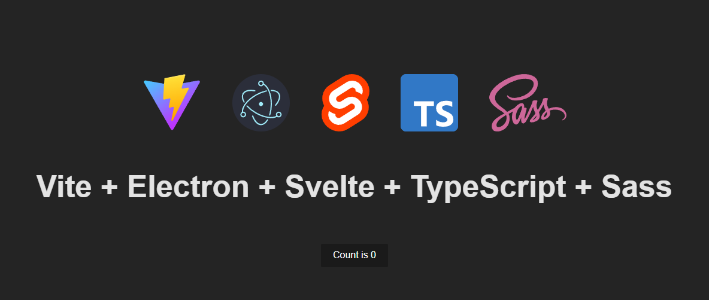

# VESTS

<p align="center">
  
</p>

Boilerplate for a Vite + Electron + Svelte + TypeScript + Sass project.

The project is split into 3 units: `main`, `preload`, and `web`. Each unit has its own `tsconfig.json` and `vite.config.ts`, and are built separately.

Thanks to [this article](https://blog.totominc.io/blog/electron-with-typescript-and-vite-as-a-build-system) for helping me set up this tech stack!


## Project structure

```
project/
│
│  · compiled folder
├─ dist/
│  ├─ main/
│  ├─ preload/
│  └─ web/
│
│  · source folder
├─ units/
│  ├─ main/
│  │  ├─ src/
│  │  ├─ tsconfig.json
│  │  └─ vite.config.ts
│  ├─ preload/
│  │  ├─ src/
│  │  ├─ tsconfig.json
│  │  └─ vite.config.ts
│  └─ web/
│     ├─ public/
│     ├─ src/
│     ├─ index.html
│     ├─ svelte.config.js
│     ├─ tsconfig.json
│     └─ vite.config.ts
│
│  · project files
├─ package.json
├─ readme.md
└─ tsconfig.node.json
```


## Scripts

start

```electron .```

build

```npm run build:web && npm run build:preload && npm run build:main```

package

```npx electron-packager ./ --platform=win32 --arch=x64 --icon=./assets/icon.ico --overwrite```

build:main

```tsc -p units/main/tsconfig.json --noEmit && vite build units/main```

build:preload

```tsc -p units/preload/tsconfig.json --noEmit && vite build units/preload```

build:web

```tsc -p units/web/tsconfig.json --noEmit && vite build units/web```

dev:web

```vite units/web```


## Stack

| Tech       | Website                          |
| ---------- | ---------------------------------|
| ViteJS     | https://vitejs.dev/              |
| Electron   | https://www.electronjs.org/      |
| Svelte     | https://svelte.dev/              |
| TypeScript | https://www.typescriptlang.org/  |
| Sass       | https://sass-lang.com/           |